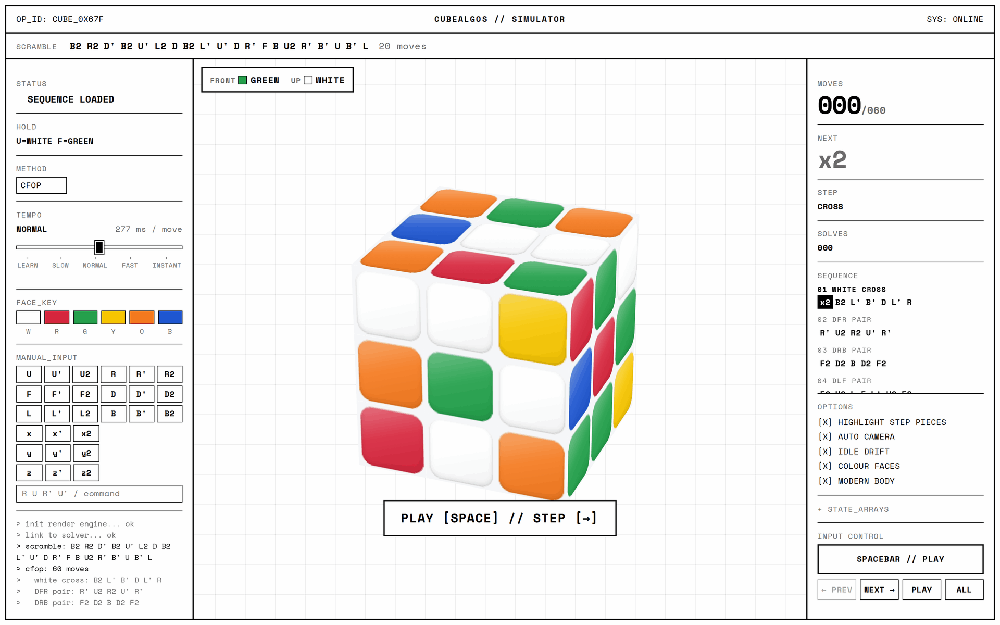

 

# cubealgos

`cubealgos` is a Rubik's Cube solver written in C++. It generates WCA random-state
scrambles and solves them with a choice of methods.

[](#build)
[](LICENSE)
[](#build)

## Build

Needs a C++17 compiler and `make`.

```sh
make              # builds ./cubealgo and ./tests
make test         # runs the test suite
make wasm         # the engine for the web simulator, see below
```

## Run

```sh
./cubealgo
```

Pick a method, then press ENTER for a WCA random-state scramble and its solution.
`m` changes method, `q` quits.

## Web Simulator



A React front end for the engine, in `Web/`. The same C++ solvers are compiled to
WebAssembly and run in a worker in the visitor's browser, so the site is plain static
files with no server behind it.

Needs [emsdk](https://emscripten.org/docs/getting_started/downloads.html) and Node 20+.

```sh
make wasm                 # compiles the engine to Web/src/engine/
cd Web && npm install
npm run dev               # local dev server at http://localhost:5173
npm run build             # static site in Web/dist/
```

The site has three pages:

- **Timer**: a csTimer-style cube timer. Hold Space (or touch the clock) until it turns
  green, release to start, any key to stop. WCA random-state scrambles with a preview
  net, optional 15 s inspection with +2/DNF, and optional CFOP stage splits (press once
  at the end of the cross, F2L and OLL). Solves are kept in sessions in the browser's
  IndexedDB, with ao5/ao12/ao50/ao100, penalties, and JSON export and import.
- **Stats**: times and averages over the session, the time distribution, average stage
  splits, and coaching ranked by time to gain: which CFOP stage is out of proportion,
  what colour neutrality would save (every scramble's optimal cross on all six colours,
  from the engine), consistency and penalties. Click any solve for its own breakdown
  and a replay of the engine's CFOP solution in the simulator.
- **Simulator**: Space scrambles the cube, Space again loads the CFOP or Kociemba
  solution, and the arrow keys step through it while Space plays it. Drag to orbit,
  turn the cube by hand with the keypad or a typed sequence, and type `help` in the
  command box for the rest.

### Deploying

`.github/workflows/pages.yml` runs the tests, builds the engine and the site, and
publishes it to GitHub Pages on every push to `main`. Turn it on once under
Settings → Pages → Source: GitHub Actions. `Web/dist/` also drops straight onto
Netlify, Vercel or Cloudflare Pages; set `BASE_PATH` when the site is served from a
subdirectory.

## License

MIT
